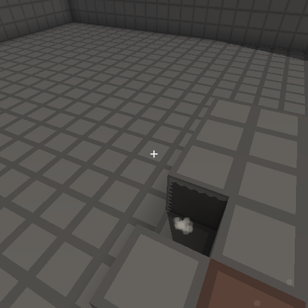

<div align="center">

<picture>
  <source media="(prefers-color-scheme: dark)" srcset="assets/brand/renew-banner-wide.svg">
  <source media="(prefers-color-scheme: light)" srcset="assets/brand/renew-banner-wide-light.svg">
  
</picture>

<br>
<br>

[](https://github.com/renew-engine/renew/actions/workflows/ci.yml) [](https://github.com/renew-engine/renew/actions/workflows/nightly-checks.yml) [](LICENSE) [](rust-toolchain.toml)

**[See it running](#see-it-running)**&nbsp; · &nbsp;**[Quick start](#quick-start)**&nbsp; · &nbsp;**[Determinism](#determinism-is-the-point)**&nbsp; · &nbsp;**[Platforms](#platforms)**&nbsp; · &nbsp;**[Modules](#the-engine)**&nbsp; · &nbsp;**[Contributing](CONTRIBUTING.md)**

</div>

---

**renew is a game engine in Rust, built to be operated.**

Every capability is a library with a command-line face and machine-readable output. Building,
testing, packing assets, recording a play session, replaying it, benchmarking, and running any
sample all happen from one binary, headless, with `--json` on every command. A person, a script,
and an agent drive the engine through exactly the same surface, because there is only one.

Underneath it, the simulation is bit-deterministic by construction. Same build, same seed, same
inputs, same result, down to the byte, on every platform the engine targets.

> [!IMPORTANT]
> **Early development, pre-0.1.** APIs change without notice and no module has reached `stable`
> maturity yet, so this is not something to start a shipping game on today. Everything described
> below exists, runs, and is covered by tests. Nothing here is a plan.

## See it running

Every picture below is committed in this repository and produced by the sample under it. None of
them are mockups.

<table>
<tr>
<td width="33%"></td>
<td width="33%"></td>
<td width="33%"></td>
</tr>
<tr>
<td><b>cube</b><br><sub>A voxel world with a walking, jumping, block-breaking player.</sub></td>
<td><b>cube</b><br><sub>Breaking a block, with the particle pool running at the simulation's cadence.</sub></td>
<td><b>glide</b><br><sub>A small complete game, playable in a window or driven from a trace.</sub></td>
</tr>
</table>

Six samples ship with the engine, and each one runs headless and answers with a digest:

```console
$ cargo run -p renew-sample-cube --bin cube
cube script=stand source=script ticks=600 digest=0xcbc2871e466a6bfc solids=5012 broken=0 placed=0 grounded=true

$ cargo run -p renew-sample-leap --bin leap
leap script=stand ticks=600 digest=0xd7058b85479adeb4 grounded=true wall=false

$ cargo run -p renew-sample-glide --bin glide -- --frames 600
renew-frame sample=glide seed=7 source=soar frames=600 ticks=600 dropped=0 score=3 alive=1 schedule_hash=0x55ce27c8dcb97c4d state_hash=0xe8f68645bf927702
```

Run any of them again, on any machine, on any supported operating system. The digests do not move.

## Quick start

Stable [Rust](https://rustup.rs) 1.97 or newer. That is all the engine and its headless samples
need. Opening a window or playing audio on Linux additionally wants the usual desktop development
packages, the same ones any Rust graphics project asks for.

```sh
git clone https://github.com/renew-engine/renew
cd renew
cargo run --bin renew -- build
cargo run --bin renew -- test
```

Then pick something to look at:

```sh
# a 3D voxel world, drawn to a window
cargo run --bin renew -- --features window run cube -- --window

# the same world, headless, answered with one line
cargo run -p renew-sample-cube --bin cube -- --script patrol --ticks 2000

# chess, counting every legal game four plies deep
cargo run -p renew-sample-chess --bin chess
```

## Determinism is the point

Most engines treat reproducibility as a feature you bolt on for netcode or for replays. Here it is
the constraint everything else is built around, and the parts that make it possible are not
optional extras:

- the simulation runs on a **fixed timestep over integer nanoseconds**, and the frame loop is
  handed its clock rather than reading one
- simulation arithmetic is **Q47.16 fixed point**, so no floating-point mode or instruction
  selection can change a result
- storage has a **defined iteration order**, because an undefined one is a determinism bug waiting
  for a rehash
- randomness is **seeded and explicit**, with no thread-local state and no entropy a caller did not
  ask for

The engine can prove it about itself. One command runs a pinned set of simulations and writes what
they produced:

```console
$ cargo run --bin renew -- determinism --emit windows.json
wrote 15 digests for windows/x86_64 to windows.json
```

```jsonc
{
  "schema_version": 1,
  "os": "windows",
  "arch": "x86_64",
  "toolchain": "rustc 1.97.1 (8bab26f4f 2026-07-14)",
  "digests": {
    "cube/build-900/digest": "0xce632722e5698fa1",
    "glide/seed-7-600/state_hash": "0xe8f68645bf927702",
    "chess/play-60/digest": "0x6bf0be22d95711ee"
    // 12 more
  }
}
```

On every commit, CI produces that file on **five targets** and holds them against each other.
Windows, Linux and macOS on the desktop, an Android emulator, and an iOS simulator. A digest that
differs anywhere fails the build. Comparing against a value committed in the repository would prove
only that one machine agrees with its own past; comparing targets against each other is what
actually establishes the claim.

## Platforms

| Target | Builds and tests | Simulation digests match | Draws a frame |
|---|---|---|---|
| Windows, Linux, macOS | yes | yes | yes |
| Android | yes | yes, on an emulator | not yet in CI |
| iOS | yes | yes, on a simulator | yes, on a simulator |

Graphics go through an internal interface backed by Vulkan through [`ash`](https://github.com/ash-rs/ash),
with MoltenVK on Apple platforms. Windowing and input go through [`winit`](https://github.com/rust-windowing/winit).
Both sit behind engine interfaces that name no third-party type in their public API.

Mobile is honest about its evidence. An emulator is not a phone and a simulator is not a device, so
the table says which was used. Android rendering is held back by the emulator topping out at Vulkan
1.2 while the renderer requires 1.3, not by anything missing in the engine.

## One surface for everything

```console
$ cargo run --bin renew -- help
```

| | |
|---|---|
| `build` `test` `bench` `lint` `check` | the workspace, with one canonical command each |
| `run` `record` `replay` | start a sample, capture the input it saw, play it back and compare |
| `determinism` | emit this target's digests, or compare several targets' |
| `asset-pack` `asset-inspect` `ui-compile` | content, built and verified from the command line |
| `coverage` `modules` `doctor` `configure` | the state of the tree and the machine it is on |

Every one of them accepts `--json` and answers with a single document carrying a `schema_version`,
so tooling can build against a stable contract while the human-readable output stays free to
change. This is what "built to be operated" means in practice: there is no capability reachable
only by clicking, and the editor, when it arrives, will be a client of these same APIs rather than
a privileged one.

## The engine

Twenty-nine engine crates, five of them core. Everything outside the core is optional and
removable, and CI proves that one crate at a time rather than asserting it: it builds and tests a
configuration per optional crate with that crate and its dependents excluded, plus the minimal core
on its own.

| | |
|---|---|
| **Core** | `diag` logging and sinks · `event` the input vocabulary · `math` vectors, matrices, quaternions · `memory` arenas, pools, a counting allocator · `platform` the only doorway to the OS |
| **Simulation** | `fixed` Q47.16 arithmetic · `frame` the fixed-timestep loop · `ecs` sparse-set storage · `scene` transform hierarchies · `physics2d` and `physics3d` · `volume` chunked voxels · `particles` · `ui` layout solved in fixed point · `input` state and mapping · `rng` · `jobs` |
| **Rendering** | `rhi` the GPU doorway · `render2d` sprites · `render3d` indexed geometry · `camera` views and projections · `snapshot` interpolation between ticks · `ui-render` |
| **Content and IO** | `asset` content-addressed packs · `png` encoding with no dependencies · `audio` mixing and playback · `net` lockstep datagrams · `replay` record a run and play it back · `trace` the recorded-input file format |

`cargo run --bin renew -- modules` prints the live list with each crate's declared maturity, read
from its manifest rather than from this table. Maturity runs `bootstrap` to `internal` to `stable`,
and a module never claims a level it has not earned. Nothing is `stable` yet, and the list says so.

## How it is kept honest

Every commit on `main` clears all of this, on Windows, Linux and macOS:

| Gate | What it enforces |
|---|---|
| Format and lints | `rustfmt`, and `clippy` with warnings denied |
| Tests | the workspace suite, debug and release, on three platforms |
| Coverage | every line covered, or individually exempted with a written reason. The gate fails in both directions, so an exemption that becomes covered again is also an error |
| No panicking shortcuts | `unwrap`, `expect`, `panic`, `todo` and `dbg!` denied outside tests |
| `unsafe` denied by default | crates that need it opt in, and every block must document the invariant that makes it sound |
| Module graph is a DAG | manifests are checked against the real dependency graph |
| Optional crates stay removable | one build and test per crate removed, plus the minimal core alone |
| Licenses and advisories | `cargo-deny` across the whole tree, dev-dependencies included |
| Determinism | five targets compared against each other |
| Sanitizers, Miri, fuzzing | on a schedule, against the parsers and the threaded code |

Performance claims arrive with numbers and the configuration that produced them, or they are not
made. The steady-state frame loop is held to zero heap allocations through the engine's allocators,
counted in development builds.

## Contributing

Issues and pull requests are welcome. [CONTRIBUTING.md](CONTRIBUTING.md) has the workflow and the
bar a change is held to. The short version: a change arrives with its tests, its documentation, and
evidence that it works.

## License

[Apache-2.0](LICENSE). Contributions are accepted under the same license.

<div align="center">
<br>
<sub>Brand assets live in <a href="assets/brand/"><code>assets/brand/</code></a>.</sub>
</div>
