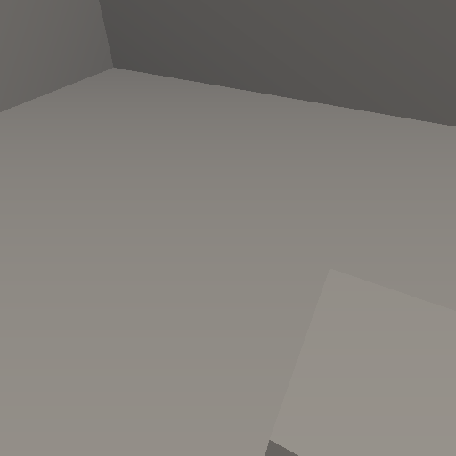
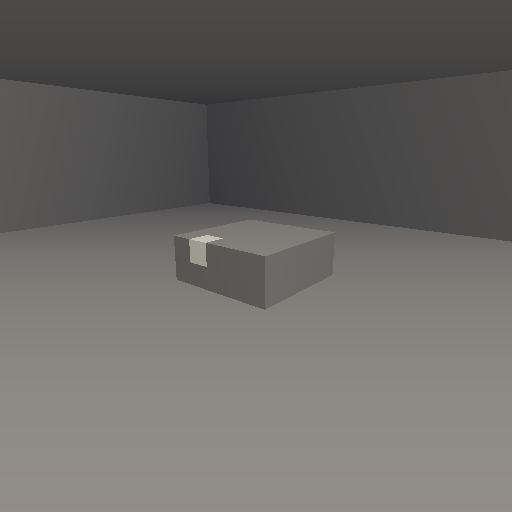
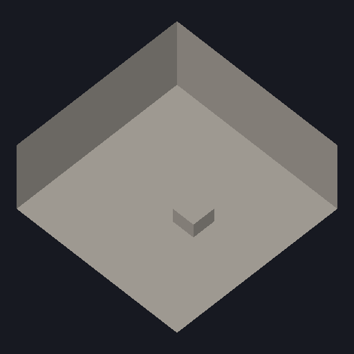

# renew-sample-cube

The three-dimensional sample: a voxel world with a walking, jumping,
block-breaking player in a closed arena, run headless from a named
script and answered with one digest line. `--show` draws the world
it left behind as two slices of text.

## Running it

```
cube                                    # the stand script, 600 ticks
cube --script patrol --ticks 2000       # walk a loop around the arena
cube --script build --ticks 900         # walk, jump, dig and place
cube --script stand --ticks 100 --show  # draw what it left behind
cube --script build --ticks 900 --json  # the same answer, for a machine
```

From a fresh clone the invocations above are spelled
`cargo run --bin renew -- run cube -- <arguments>`, or
`cargo run -p renew-sample-cube --bin cube -- <arguments>` to skip
the wrapper. `--help` lists every flag the parser accepts, and a test
holds it to that: a flag a reader cannot discover is a flag that does
not exist as far as anyone but its author is concerned.

Every run prints one line last:

```console
$ cube --script build --ticks 900
cube script=build ticks=900 digest=0xc2b4534b2679a6a1 solids=5020 broken=2 placed=10 grounded=false
```

Two runs of the same script and tick count print identical lines —
in one process and in separate ones. That is what the binary is for.
The world is a pure function and its own tests assert its digest,
which proves it reproduces on **one** machine; the obligation is
across machines, and comparing this line is how that gets checked.
The digest covers everything that can change future behaviour, the
terrain included: a world whose blocks differ plays differently from
the next tick on.

`--json` prints the same report as one document instead, carrying a
`schema_version` from its first release so a consumer can tell a shape
it understands from one it does not:

```console
$ cube --script build --ticks 900 --json
{"schema_version":1,"sample":"cube","script":"build","ticks":900,"digest":"0xc2b4534b2679a6a1","solids":5020,"broken":2,"placed":10,"grounded":false}
```

`--show` draws a plan and an elevation, each sliced through the cell
the player is standing in and labelled with where it cut:

```console
$ cube --script stand --ticks 100 --show
elevation, looking along z, at z=0
  11 #########################################
  10 #.......................................#
   9 #.......................................#
   8 #.......................................#
   7 #.......................................#
   6 #.......................................#
   5 #.......................................#
   4 #.......................................#
   3 #.......................................#
   2 #.....................#####.............#
   1 #...................@.#####.............#
   0 #########################################
     x from -20, y up the side
cube script=stand ticks=100 digest=0x1d07e6e9840ed836 solids=5012 broken=0 placed=0 grounded=true
```

Both views are the whole grid rather than a window onto it, so two
runs can be read column for column. `@` is the player, `#` a solid
block, `.` air; height increases upward in the elevation, because a
picture drawn the other way is still a correct slice and an
unreadable one. The pictures come before the summary line: a reader
scanning a terminal wants the summary nearest the prompt.

Two limits worth stating. `--show` draws nothing under `--json` — the
machine-readable output is one document and a picture is not part of
it — and the flag is accepted rather than refused there. And the
drawing is text: there is no renderer in this sample's dependency
graph at all.

## The arena

Forty-one cells across, twelve high and forty-one deep — x and z from
−20 to 20, y from 0 to 11 — and it is a **closed box, solid on every
face**.

That is not decoration. Outside the grid is neither solid nor air:
the grid answers "I do not know" past its edge rather than guessing,
so a player who leaves it falls forever with nothing to land on. The
shell refuses to be turned back into air, and the boundary it refuses
is the boundary in all three axes, so there is no direction left to
leave by. Weaker enclosures were tried first and are recorded in
[`world/README.md`](world/README.md) beside the rule itself.

Drawing the world is what exposed the problem. The first picture of it
showed the player twenty-five blocks below a floor at y = 0 after a
four-hundred-tick run — the building script had dug through the floor
and spent most of its run outside the world, and its digest described
a fall. Every test passed, because they all asked whether the run
reproduced rather than whether it made sense. `tests/view.rs` now runs
every script at six lengths and asserts the player is still inside the
grid, which is the assertion that was missing.

Closing the box also made the floor unbreakable, which quietly turned
the digging script into a script that reaches for the shell and is
refused. So the arena has a mound — x 2 to 6, y 1 to 2, z −2 to 2 —
sitting in front of the start along the direction the player looks,
and a test keeps it there.

The player's look direction is set once, down and forward, and never
changes: what a script digs at is whatever its walking puts in front
of it. That is why `build` edits less than its button presses suggest.
Over nine hundred ticks it breaks two blocks and places ten, all
within the first four hundred and fifty; after that it has walked into
a corner where the only thing in reach is shell. It also ends most
runs with `grounded=false`, which is a jump in progress rather than a
fall — a jump clears about five blocks, and the script presses jump
every seventeenth tick.

## Meshing the world

`mesh::faces` turns the grid into the block faces a renderer would draw:
one quad per solid cell face whose neighbour is air. It is pure, it holds
no renderer, and it runs on a machine with no GPU -- the same position
the platformer's `scene` module occupies, for the same reason.

**The rule is "the neighbour is air *inside* the grid", not "the neighbour
is not solid".** Those sound identical and differ by more than half the
mesh.

`Grid::is_solid` answers `false` for cells outside the grid, deliberately:
a player who walks out of the world should fall, so the void is not
something to stand on. But a mesher written against that answer emits a
face wherever the neighbour is not solid -- including every cell of the
surrounding void -- so it also emits the box's entire **outer skin**. The
faces are all behind the walls, so the picture from inside looks perfectly
correct while the mesh is twice the size it should be, and the pipeline
culls nothing, so those backfaces rasterize rather than being free.

`Grid::get` answers with three cases where `is_solid` answers with two,
and the third is the one that matters: `None` means outside. Meshing
against `get` makes the distinction structural instead of something a
reader has to remember.

**The budget, computed before the mesher was written:**

| | |
|---|---|
| Solid cells | 41x12x41 shell minus its 39x10x39 interior, plus a 5x2x5 mound = **5012** |
| Cavity skin | 2(39x39) + 4(39x10) = **4602** |
| Mound | +65 exposed, -25 floor faces it covers |
| **Visible faces** | **4642** |
| Outer skin, if the rule is wrong | **5330** more, for **9972** total |

Both numbers are asserted. Swapping the emission rule to the naive one
makes the arena mesh to exactly 9972, which is how the test knows it is
testing something: the figures were derived from the arena's dimensions
first, so a mesher that agreed with itself rather than with the arithmetic
would fail.

Faces are shaded by direction -- brightest up, dimmest down, the two
horizontal axes distinguished. Nothing lights the scene in v0, so a world
drawn in one colour per block type reads as a single silhouette with an
outline; varying the colour by which way a face points is the cheapest
thing that makes an edge visible, and it is free at runtime because the
colour is baked into the vertex. A block type with no colour of its own
comes out magenta rather than a plausible grey.

Corners are wound counter-clockwise seen from outside, on every face, and
a test says so -- even though the pipeline culls nothing today and a
reversed quad draws identically. That is exactly why: the mistake is
invisible until culling is switched on, and then half the world disappears
with no recent change to blame.

## Writing the picture out

`png::encode` turns RGBA bytes into a PNG, with no dependency. A PNG is
four chunks, two checksums and a deflate stream -- and deflate's *fixed*
Huffman tables are published constants, so a compressor good enough for
pictures of geometry needs no tables of its own.

It matches against three candidates: the pixel to the left, the pixel
above, and the byte before. Those are what a rendered picture is made of.
A 256x256 flat image comes out at about **two kilobytes** against 256 KiB
raw. Data with no such structure comes out slightly *larger* than raw,
because fixed Huffman spends nine bits on half the byte values -- an
honest trade for an encoder meant for renders rather than photographs.

That matters because these pictures are committed: an uncompressed render
would add a quarter of a megabyte to the repository's history every time
it changed.

**How it is checked, and why that is not a formality.** The tests assert
the layout against the format and pin the length and distance symbol
tables to the published ones. But a deflate stream packs everything
low-bit-first *except* Huffman codes, and a file that gets that backwards
decodes into plausible garbage rather than failing -- so the output is
also handed to an independent decoder across flat, banded, striped and
incompressible images, each checked for exact pixels.

**It caught a real defect.** The length-symbol arithmetic was off by one,
so every match of eleven bytes or more encoded as the wrong symbol. The
file was still small, still structurally a PNG, still had a valid header,
and every test in the crate passed. Only a decoder refused it.

## Playing it



The block you are aiming at is lit, and that is not decoration: every
block is the same grey, so without it you cannot tell which one **enter**
will take until it is gone. Digging is a guess otherwise.


```
renew --features window run cube -- --window
cargo run -p renew-sample-cube --features window --bin cube -- --window
```

| | |
|---|---|
| **W A S D** | walk, relative to where you are looking |
| **arrow keys** | turn left and right, look up and down |
| **space** | jump |
| **enter** *or* **left click** | break the block you are looking at, which is lit while you aim at it |
| **tab** *or* **right click** | place one against it |
| **escape** | stop |

**Walking is camera-relative, in eight directions.** The world takes
whole steps on its own axes, clamped to -1, 0 or +1, so the driver
rotates the key you pressed into a world direction and rounds it to the
nearest step the world can express. Press forward while facing north-east
and you walk north-east. It is steppy, and honest: a smoother walk needs a
fixed-point vector in the world's own vocabulary, which is a change to the
simulation rather than to the driver.

**A diagonal is about forty per cent faster than a straight line**, since
the world scales each axis by the walk speed independently and a diagonal
moves on both. That is the world's arithmetic, not the driver's, and it
predates any of this — but the driver is the first thing that lets a
player produce a diagonal at all, so it is the first place worth saying
so. Normalising it is a change to the simulation and to every digest that
walks.

**Turning is fixed point, and that is not fussiness.** Yaw and pitch feed
`Angle::sin_cos`, which is fixed point and identical on every platform,
and the result reaches the world as a direction. A float here would make
the world's digest depend on the platform's maths library, and the world's
whole claim is that it depends on nothing but its inputs. A turn and its
opposite return the view *exactly* where it began, which a test asserts
and a float would quietly lose.

**The digest line says `source=window`.** A played run is driven by a
person against a wall clock; a scripted one is a pure function of its
inputs. Their digests are not comparable, and a line that did not say
which it was would invite exactly that comparison.

**The block you are aiming at is lit.** Without it the game is played
blind: every block is the same grey, so you could not tell which one the
next keypress would break until it was already gone. The colour lives in
the vertices, so moving the aim rebuilds the geometry -- which happens
when the aim crosses from one block to another, not every time you turn.

**A named script can drive it instead of you.** `--window --script
build` watches the world build itself, with the camera on the player's
head; `--script` alone with no window runs the same script headless and
prints its digest. `stand` is genuinely idle, so it is both the default
and the way to say "no script, I am playing" — which is why watching does
not need a flag of its own.

**Looking is on the keys, not the pointer.** Turning the view with the
mouse needs the cursor held inside the window, and this engine's window
layer has no way to ask for that yet. A mouse-look that stops dead when
the pointer reaches the edge of the screen is worse than one that is
honestly absent, so the arrows do it and the mouse breaks and places.

**Pitch stops short of vertical.** At exactly straight up the look
direction is parallel to world up, the camera basis has no unique answer,
and the picture would roll on its own axis for no input.

**The geometry is uploaded once and redrawn from every angle.** Turning
does not rebuild it -- that is what putting the camera matrix on the GPU
bought. Only breaking or placing a block does.

## Seeing it from inside



A real camera, with a real perspective divide. `--eye` and `--look-at`
place it; `--view player` uses the player's own eyes.

```
renew --features render run cube -- --eye -8,6,-10 --look-at 4,1.5,0 --render room.png
renew --features render run cube -- --view player --render eyes.png
```

**`--view player` is not the default, and the reason is the picture it
draws.** The player spawns a step from the mound, so a still from their
eyes is one grey filling the frame — it would pass a check that geometry
drew while showing nothing a reader could compare against the world. The
view from inside is worth having; it is worth asking for, from a
viewpoint that shows something. The picture above is `--eye`/`--look-at`
for exactly that reason.

**The matrix goes to the GPU as per-instance vertex input.** That is not
a workaround for the shortest path: this engine has no push-constant
range anywhere, and its one descriptor set binds a combined image sampler
to the fragment stage, so per-instance input at binding 1 is the only
route a matrix can take — and it is the one the mesh path deliberately
left composable.

It is also the right answer regardless. `gl_Position` carries a real `w`,
so the hardware performs the perspective divide and the clipper handles
geometry behind the eye. Transforming vertices on the way in would mean
**clipping polygons against the near plane in this sample**, because a
triangle crossing `w = 0` cannot be divided at all — and inside a room,
with walls behind you, that is not a corner case. It also means the mesh
never re-uploads when the camera moves.

**Distance fades toward the horizon colour**, which is the only depth cue
a flat-shaded room has beyond the outline where two faces meet -- without
it a near wall and a far one are the same grey and the space reads as a
paper cut-out. It is computed from clip `w`, not from depth: after a
perspective projection `w` is the distance along the view direction while
depth is compressed toward the near plane, so a fade driven by depth turns
the whole room to fog a few blocks in. That is not a hypothetical; it was
the first picture.

**The free camera is explicit, never accumulated.** Two points on a
command line, not mouse deltas: a picture that depended on how somebody
moved their hand could not be compared, and these pictures are committed.

## Drawing it



`cube --render arena.png` draws the world through the 3D renderer and
writes the picture above. The `render` feature builds it in; without the
feature the flag is refused by name rather than ignored, and the game a
player runs carries no graphics crate at all.

```
renew --features render run cube -- --view iso --render arena.png
cargo run -p renew-sample-cube --features render --bin cube -- --render arena.png
```

Either command draws it: the isometric view is what `--render` draws when
no `--view` is given, and naming it changes nothing.

**The view is a fixed true isometric** -- a 45 degree turn and a 35.264
degree tilt -- with no camera anywhere, because a camera is a later step.
Every entry of that basis is a square root rather than a sine, which is
not a style choice: `sqrt` is required by IEEE 754 to be correctly
rounded and is therefore identical on every platform, while `sin` and
`cos` are not, and this picture is committed and compared.

**Half the faces are dropped before drawing, and that is the picture.**
The arena is a closed box, so every face the mesher emits points inward.
Drawn from outside, the nearest surface along every ray is the underside
of the near wall, which fills the frame -- a technically correct render
of the world and useless to look at. Nothing culls it, because the
pipeline draws both sides of everything. So the render drops the faces
turned away from the eye, which cuts the near walls off and leaves a view
*into* the room: 2321 quads of the 4642 the world has, exactly half,
since for each pair of opposite directions one faces the viewer.

That split is a fact about where the viewer stands rather than about the
world, which is why it lives in the render and not in the mesher.

**What the picture shows.** The bright diamond is the floor, whose faces
point up and take the brightest shade. The two darker bands are the inner
faces of the east and north walls. The small notch at the centre is the
mound -- its top is the same shade as the floor, because both point up
and nothing lights the scene, so only its two side faces separate it.
That is the honest limit of flat shading, and what a texture atlas or a
light would change.

## Shape

Two crates. `world/` is the simulation: a fixed-step pure function of
terrain and per-tick intent, with no clock, no file and no randomness
— see [`world/README.md`](world/README.md). This crate is the driver.
It builds the arena, owns the scripts, runs the loop, and owns
everything printed.

The scripts are built in and named rather than read from a file,
because the point of the binary is to be run identically on three
platforms and compared, and a file is one more thing that can differ
between them.

Everything the binary does — parsing, running, drawing, choosing the
exit code — lives in the library, so it can be driven by a test
without spawning a process; the parts most worth testing are the
refusals, and a spawned process is what makes those hardest to
inspect. `tests/binary.rs` spawns one anyway, because the process
shell, the argument plumbing and the exit codes are only exercised as
a caller meets them.

Exit codes: `0` for a completed run and for `--help`, `1` for a
command line this sample cannot honour. A refusal goes to the error
stream, prints nothing on the output stream, and names the thing at
fault — an unknown script also lists the real ones.

## Manifest

`Cargo.toml` is authoritative for maturity, core status, dependencies
and extension points.
