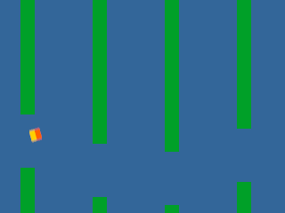
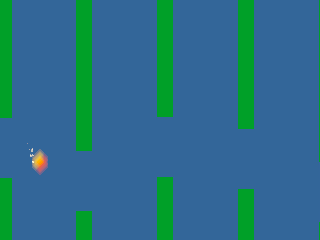

# renew-sample-glide

A small complete game, headless-first: the glide world driven by
scripted traces or a recorded replay — and, behind the `window`
feature, playable in a window with the score in the title. Behind
`audio`, it makes sounds while you play.

## What it looks like






The bird tilts with its velocity — nose-down as it falls, up on a flap
— and its orange beak shows which way, because a square turned by an
angle and by its negative looks the same. The corpse keeps the tilt
death left it with, and is drawn in grey — the same sprite desaturated
to its own luminance, so it keeps its shape and its brightness and loses
only its colour.

**This is not a fresh render.** It is the committed golden image -- the
exact frame CI compares, drawn on the pinned software rasterizer, with a
provenance sidecar beside it naming the driver, the shaders, the trace
and the tick. Converting that to a PNG shows the frame that is
*verified*, rather than one drawn by a second path that nothing checks.

`cargo run -p renew-sample-glide --example make_picture` regenerates it
from the goldens whenever they are refreshed. `dive-361.png` is the same
trace as `soar-600.png`, at an earlier tick; `sink-240.png` and
`crash-114.png` come from a second trace, one that never flaps. In `dive-361.png` the bird
is falling as fast as the rules allow, and while it dives a short
vertical ghost trails it along its fall — the sprite drawn as the
average of itself over the last eight ticks of its motion, which is what
a camera records of anything moving during an exposure. In
`sink-240.png` the bird has hit the floor, and the corpse lies nose-down
at a full eighth turn — the tilt its terminal fall left it with — with
no ghost at all, because a corpse is not going anywhere.

`crash-114.png` is that same fall six ticks after it ended, drawn from
the `sink` trace at tick 114. Two dozen sparks are thrown up out of the
corpse and fall back under a gravity of their own, each turning at its
own rate. **They are light, not paint:** every spark carries a
premultiplied colour with an alpha of zero, which the sprite renderer
adds to what is already there rather than compositing over it — so a
spark brightens whatever it crosses and hides none of it, out of the
same single pipeline every other sprite in the frame goes through. In
this particular frame what they cross is only sky: the corpse lies at
the left and the nearest pipe is a hundred and seventy pixels away. The
burst is seeded from the tick the run stood at when its pool was made,
so replaying the trace draws the same sparks in the same places; the
picture is a function of the run, not of when it was rendered.

**A spark trail follows the living bird**, shed backwards off its
trailing edge for as long as it is flying and stopping on the tick it
dies. It is the same kind of light as the crash — added to the sky,
hiding nothing — out of the same one pipeline, but it is its own effect
rather than the crash's aimed sideways: an explosion throws hard and
wide and falls fast, a trail is dropped gently and lags behind, and one
set of numbers cannot be both. It is also its own pool. Sharing the
crash's would have let a trail that happened to be full on the tick the
bird died silently shorten the burst, because a pool that is out of room
drops what it cannot fit without saying so — and the crash is the one
moment in this game that has to look right.

## Running it

```
glide                                  # seed 7, the soar trace, 2000 frames
glide --seed 3 --frames 600            # shorter, different world
glide --input-trace sink               # no input; gravity wins
glide --record-trace out.trace         # record the run's input
glide --replay-trace out.trace         # the recording owns the run
```

Every run prints one digest line last; two runs with the same seed,
trace and length print bit-identical lines, cross-process, and the
test suite holds that.

The library also exposes `world_at(trace, tick)` and its sibling
`drawn_at(trace, tick)`, which returns the presentation effects beside
the world — the same replay loop the runs use, promoted so image
oracles need not copy it — and a pure `scene` module that turns a
world into draw-order rectangles with no GPU crate in the normal
graph. The frame-capture test consumes both: committed traces
replayed to a checkpoint, drawn through the
sprite renderer offscreen, compared against committed images. The GPU
crates enter the normal graph only behind the `window` feature (and
the dev graph for the oracle); the default build carries none of
them, and the build matrix proves it with a build-only probe.

`--window` opens the game, and the `window` feature is what builds the
window in. Either of these works from a clean clone:

```
renew --features window run glide -- --window
cargo run -p renew-sample-glide --features window --bin glide -- --window
```

The feature is not on by default, and that is the point rather than an
oversight: the build matrix proves the game builds and runs with no
graphics crate in its graph at all, which stops being true the moment
the window is always compiled in.

Space or the primary mouse button flaps, the score lives in the
title, and the digest line prints at close marked `source=window` so
nothing ever compares a wall-clock run against a scripted one. Flap
edges ride a saturating counter consumed one per fixed step — a press
on a frame that plans no steps survives to the next, and two presses
with two due steps deliver two flaps.

`--features audio` adds sound: a flap when the world consumes one, a
tone per pipe cleared, a buzz on death. The feature requires `window`
structurally, because sound is wired into the windowed driver and a
headless run is the one whose bytes are compared. What is played is
derived per simulation tick rather than per frame, so a frame that
catches up several ticks keeps their order — clear a pipe and die in
the same frame, and that is the order you hear — and a press buffered
before a crash stays silent, because the world could not consume it.

The three sounds live in `sounds/` and the generator that wrote them
lives in `examples/make_sounds.rs`; bytes and generator change together
in one commit, and `sounds/README.md` carries the record. A machine
with no sound card plays the game in silence and says so once at
close, which is not a failed run.

`--replay-trace` owns the whole run — the header carries the seed and
the length — so the flags it would contradict are refused by name
rather than silently ignored.

## When something goes wrong

Set `RENEW_LOG` to a file path and the run reports into it: the engine's
own error channel, and any panic.

```
RENEW_LOG=run.log glide --window
```

```powershell
$env:RENEW_LOG = "$env:USERPROFILE\run.log"
.\target\debug\glide.exe --window
```

An environment variable rather than a flag, because a panic that happens
before the command line is parsed still needs somewhere to go. An empty
value counts as unset. Every sample takes it, including the ones with no
graphics at all, where what it carries is a panic.

**Every log says whether graphics validation was on**, in its first
line, both ways round. Validation is a separate switch:

```
RENEW_LOG=run.log RENEW_VALIDATION=1 glide --window
```

They are separate deliberately. The validation layer reports faults
inside the driver that nothing else here can see — and it changes
timing, so a fault that depends on timing can behave differently, or
vanish, when it is on. The first capture worth having is of the run that
actually failed, unperturbed; validation is the second look, taken
knowingly. A log that did not say which kind of run it recorded would be
impossible to compare against another.

The file is appended to, never truncated, so several runs at one path
accumulate. It is created as soon as logging starts, so an **empty file
means logging was on and nothing was reported** — which is a different
thing from no file, meaning it was never on. A path that cannot be
written is said once on the error stream and the run continues; a broken
log must not become a broken run.

**What it cannot catch:** a driver that takes the process down leaves
nothing to write with. A log that ends mid-run, with a nonzero exit and
no failure line, is itself the finding — it says the fault was below the
engine rather than in it.

## The pause menu, and why the digest moved

Escape pauses. The menu is a real retained widget tree — the same
arena, solver, and hit-tester every document uses — and it IS a
document now: `menu.ui` beside this crate is the authored form,
`menu.uib` the compiled blob the game embeds, held byte-identical by
the compiler's fidelity gate. The document owns the boxes and the
hover and pressed dress the buttons wear — resolved into state
tables at compile time, worn at runtime as one lookup and one swap,
with a colour-only flip provoking no layout walk (a counter assert,
not a promise). What the buttons say stays in code, beside what
they do; a test holds the authored boxes against the measured
labels so neither drifts without the other.
While it is open the world stands still and the session keeps
counting: events index by session tick, so every trace recorded
before the menu existed replays unchanged, and a trace that pauses
carries events at ticks the world never stepped.

The reported digest is the session's, not just the world's: the
world's own fold first, then whether the menu is open — a bit that
decides if the world steps at all — then every decision the tree
made, in order. A menu that can restart the run is gameplay, and a
digest that ignored it would call two different sessions the same.
That is why the reported hash changed when the menu landed: not a
regression, but coverage arriving. The world's own digest is
untouched, and its frozen pin still stands.

The `menu` trace exercises the whole road: it flies, pauses to
resume, pauses again to restart, and flies the new run; a test pins
the world's tick count mid-trace and after the restart, so a pause
that leaked steps or a restart that kept the old world would move an
integer the suite watches. Clicks route to exactly one listener: the
menu hears everything, gameplay hears an event only if the menu was
closed as it arrived, so the click that presses Resume never also
flaps.

## Shape

Two crates. `world/` is the simulation — a pure fixed-step function of
seed and per-tick input, forbidden by the workspace structure rules
from reaching a clock, a file or a window at any dependency depth.
This crate is the driver: it maps input to the world's one action
through the same bindings the windowed mode uses, runs the loop on a
synthetic clock, and owns every file that is read or written.

Traces index events by tick from zero, exactly as the loader returns
them; there is no frame-numbering shift anywhere in this sample.

The sparks are **presentation state**, like the snapshots the blended
picture interpolates: two particle pools seeded from the tick and
advanced once per executed step, one watching the world for the moment
liveness falls and one shedding for as long as it has not. They read the
world and never write it, so the digest is the same whether or not
anything is drawing — which the driver's tests assert either side of a
burst rather than leave to inspection. Seeding from the tick is what
makes the sparks a function of the replay, so the same trace draws the
same sparks on any machine; the two pools draw from separate streams, so
how long the bird flew before it died cannot change what the crash looks
like. The pools' arithmetic needs no GPU, so they live in the game's
ordinary dependencies and the headless build carries them without a
rendering crate in sight.

Because the trail is accumulated over a whole flight rather than implied
by the world's final state, an image oracle cannot rebuild it from a
finished world — so `drawn_at(trace, tick)` returns the pools the run
actually accumulated beside the world, out of the same replay loop the
runs use. That is the same reason `world_at` was promoted rather than
copied: one loop, however many consumers.

The picture is drawn on a 320x240 canvas, and the window presents that
canvas stretched to whatever size the window is. A turn is isotropic on
the canvas — the rendering crate maps corners to the screen after the
turn, not before — so the tilted bird stays square there whatever the
canvas shape; on screen it stays square only while the window keeps the
canvas's four-to-three. The canvas, not the surface, is where that
guarantee lives.

## Manifest

`Cargo.toml` is authoritative for maturity, core status, dependencies
and extension points.
